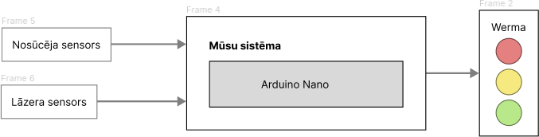
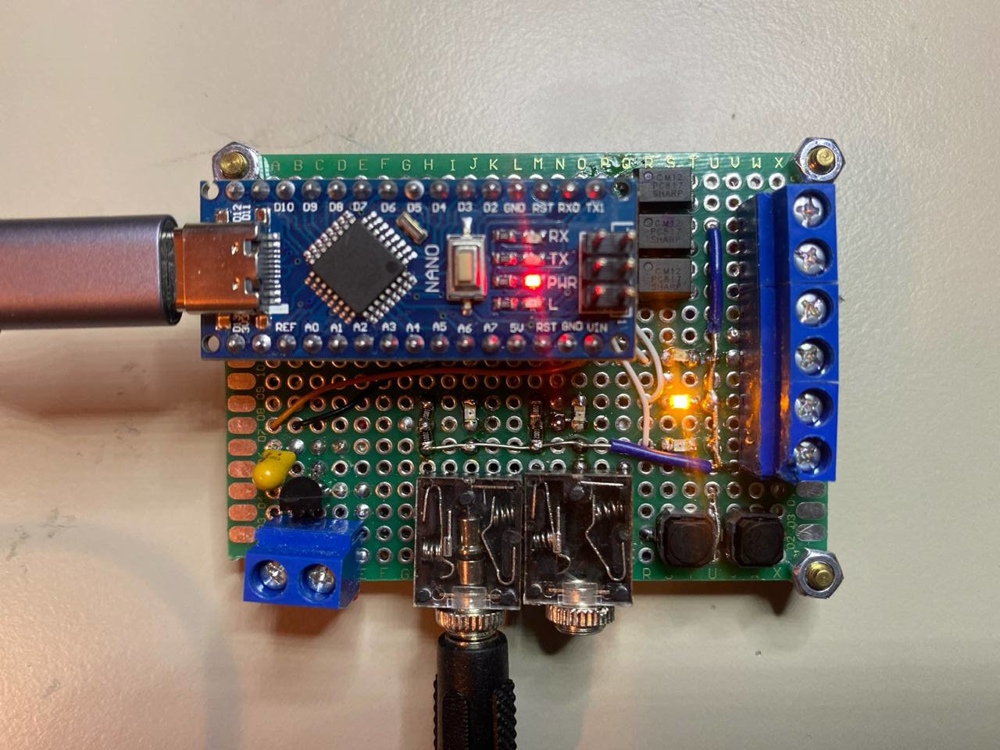
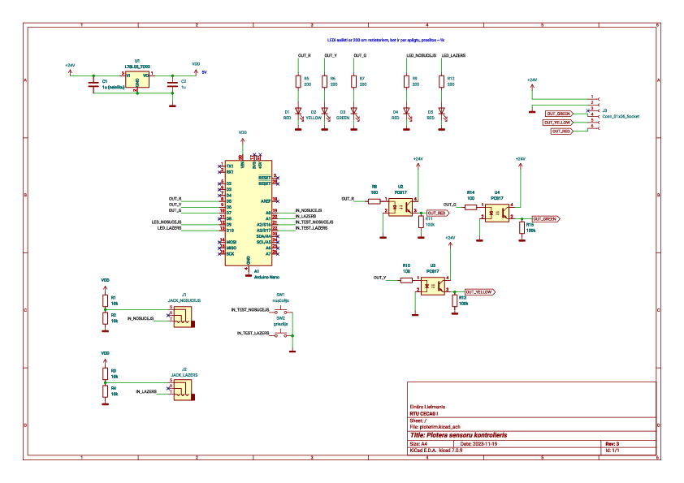
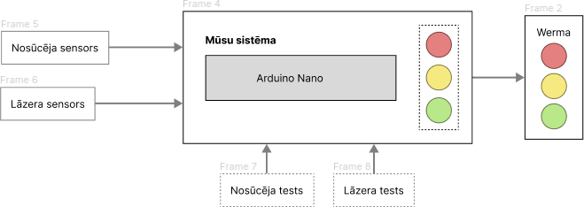
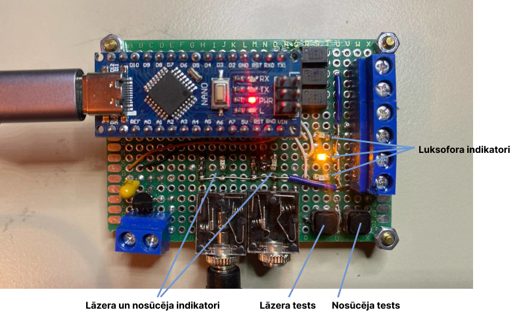
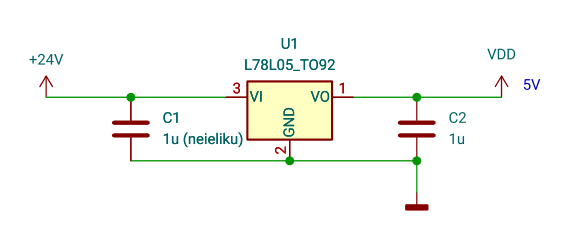
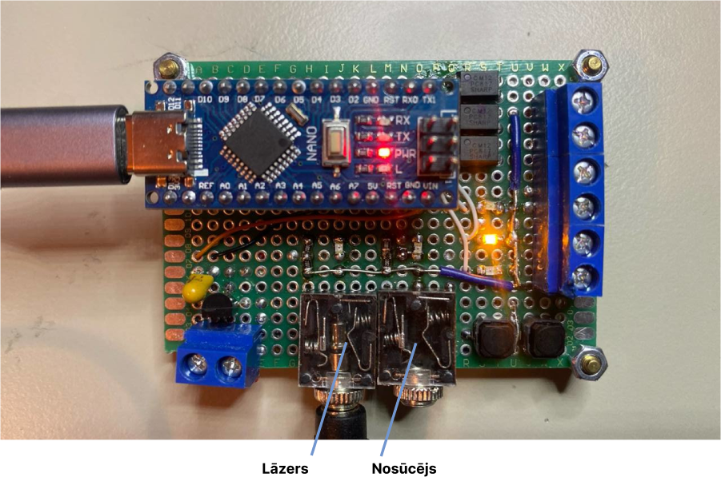
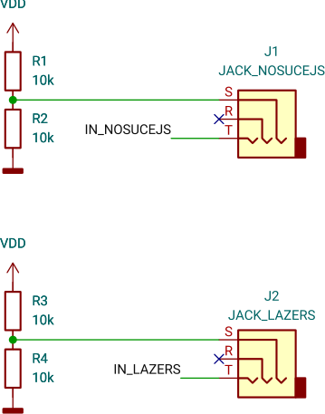
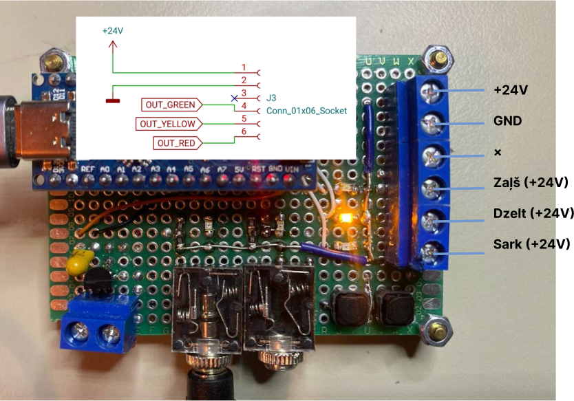

# Neinvazīva sistēma lāzergriezēja monitorēšanai

Einārs Lielmanis, 2024

https://github.com/einars/rtu-lab-sensori

---
# Arhitektūra



---




---
# Shēma

https://github.com/einars/rtu-lab-sensori/tree/main/kicad/ploterim



---

# Arhitektūra ar testiem



---

# Testi



---

# Barošana

- USB
- 24V 

  

- abus kopā nevajadzētu

---

# Ievade

  

---

# Ievade

  

---

# Izvade



---

# Kods

## Ploteris

Steitmašīna: Idle → Printing → Cooldown → Finished (→ Printing)

Cooldown periods definēts kodā.

## Nosūcējs

Steitmašīna On → Off (→ On)

Raugoties uz šiem stāvokļiem, algoritms izdomā, cik veselīgu luksoforu attēlot.

---

```C
    Health h = Health::Ok;

    if ( ! n.nosuce_on) {
        h = Health::ErrNosucejs;
        if (n.plotter != Plotter::Idle && n.plotter != Plotter::Finished)
            h = Health::ErrNosucejsEmergency;
    } else
        if (n.plotter != Plotter::Idle && n.plotter != Plotter::Finished)
            h = Health::Working;

    switch (h)
    case Health::Ok:
        if (n.plotter == Plotter::Finished) leds(0, 0, 1);
        else leds(0, 0, 0);

    case Health::ErrNosucejs:
        leds(0, 1, 0);

    case Health::ErrNosucejsEmergency:
        leds(1, 1, 0);

    case Health::Working:
        leds(1, 0, 0);
```

---

# Praktiski

- Testi ļāva darboties bez pašas iekārtas

- analogie lasītāji praksē šobrīd nestrādā: kaut kur, lodējot, kļūme un, pieslēdzot vienu, abos nolasās miskaste

---

# Challenges

- smd ir lieliski, through-hole — ķēpa
- maketplates savienojumi ir elle

# Next

- Uzmaketēt īstu platīti
- Izveidot kastīti
- Iedzīvināt dzīvē
